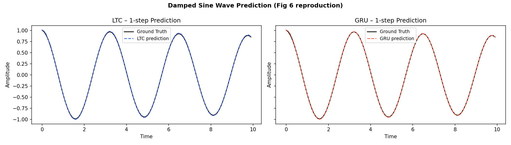
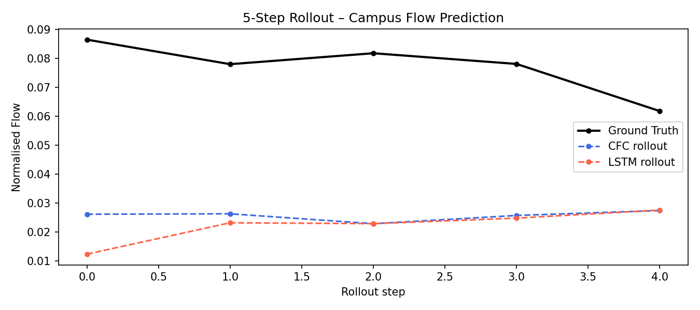
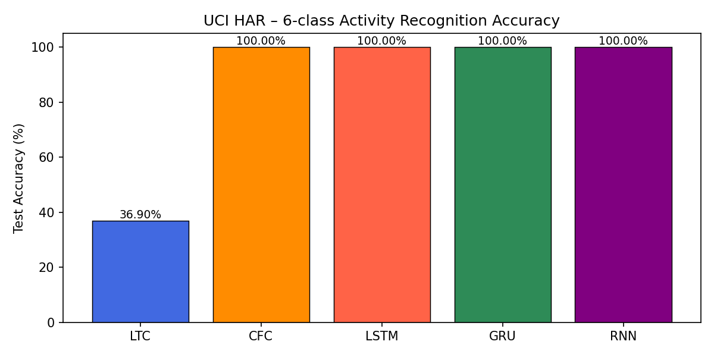
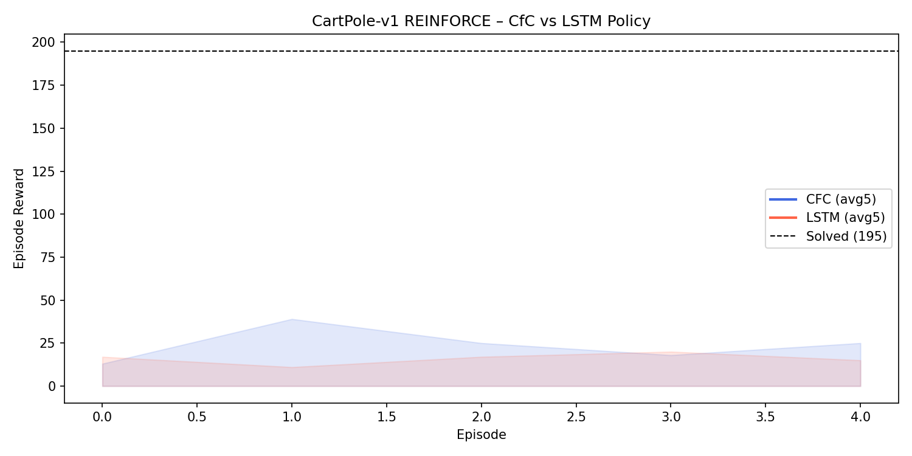

# lnn-project

> 液态神经网络与普通神经网络的对比研究  
> *Comparative Study of Liquid Neural Networks and Conventional Neural Networks*  
> **大学生创新训练项目（SITP）**

---

## Project Overview

This project systematically compares **Liquid Neural Networks** (LTC / CfC) with conventional neural networks (LSTM, GRU, RNN) across multiple benchmark tasks, aiming to provide a reproducible, quantitative analysis of their trade-offs in accuracy, parameter efficiency, and interpretability.

See the full Chinese SITP proposal: [docs/proposal.md](docs/proposal.md)

---

## Goals

- Implement and understand the mathematical foundations of LTC and CfC models
- Benchmark liquid vs. conventional networks on time-series, classification, and control tasks
- Provide a reproducible, open-source codebase for the Chinese research community

---

## Models to Implement

| Model | Type | Description |
|-------|------|-------------|
| LTC | Liquid Neural Network | Liquid Time-Constant Network |
| CfC | Liquid Neural Network | Closed-form Continuous-time Neural Network |
| LSTM | Conventional RNN | Long Short-Term Memory |
| GRU | Conventional RNN | Gated Recurrent Unit |
| RNN | Conventional RNN | Vanilla Recurrent Neural Network |

---

## Experiment Tasks

| # | Experiment | Script | Key Metric |
|---|-----------|--------|------------|
| 1 | **Damped Sine Wave Prediction** (Fig 6 reproduction) | `experiments/damped_sine.py` | MSE / MAE |
| 2 | **Walker2d Trajectory Prediction** (Section 4.1 reproduction) | `experiments/walker2d.py` | MSE, training time |
| 3 | **Campus Flow Prediction** (SITP innovation) | `experiments/campus_flow_exp.py` | MSE, 5-step rollout |
| 4 | **Multi-dimensional Robustness Evaluation** | `experiments/evaluation.py` | RMSE@σ, R², inference latency |
| 5 | **Financial Time-Series Prediction** (NASDAQ 30→5 days) | `experiments/timeseries_finance.py` | MSE / MAE |
| 6 | **UCI HAR Sequence Classification** | `experiments/uci_har.py` | Accuracy, parameter count |
| 7 | **CartPole-v1 RL Control** (REINFORCE) | `experiments/cartpole_rl.py` | Convergence speed, final reward |

---

## 🚀 Quick Start

```bash
# Install dependencies
pip install -r requirements.txt

# Run all experiments (full training)
python run_all.py

# Quick smoke-test (5 epochs each)
python run_all.py --fast
```

Results (CSV + PNG plots) are saved to `results/`.

---

## 🖼️ Results Preview (图文速览)

以下为各实验自动生成的示例图表（运行后会更新到 `results/`）：

### Damped Sine (预测效果)


### Campus Flow (多步滚动预测对比)


### UCI HAR (模型分类准确率对比)


### CartPole (强化学习奖励曲线)


---

## 📂 Project Structure

```
lnn-project/
├── src/
│   ├── models/
│   │   └── registry.py              # Unified model registry (LTC, CfC, LSTM, GRU, RNN)
│   └── data/
│       └── campus_flow.py           # Campus pedestrian-flow data generator
├── experiments/
│   ├── damped_sine.py               # Exp 1: Fig 6 reproduction — 1-step sine prediction
│   ├── walker2d.py                  # Exp 2: Sec 4.1 reproduction — Walker2d trajectory
│   ├── campus_flow_exp.py           # Exp 3: SITP innovation — campus flow CfC vs LSTM
│   ├── evaluation.py                # Exp 4: Robustness & performance summary table
│   ├── timeseries_finance.py        # Exp 5: NASDAQ financial time-series prediction
│   ├── uci_har.py                   # Exp 6: UCI HAR sequence classification
│   └── cartpole_rl.py               # Exp 7: CartPole-v1 RL (REINFORCE)
├── results/
│   ├── damped_sine/                 # loss_curves.png, predictions.png, metrics.csv
│   ├── walker2d/                    # loss_curves.png, metrics.csv
│   ├── campus_flow/                 # loss_curves.png, rollout_comparison.png, metrics.csv
│   ├── evaluation/                  # robustness_curve.png, performance_table.md/.csv
│   ├── timeseries_finance/          # loss_curves.png, metrics.csv
│   ├── uci_har/                     # loss_curves.png, metrics.csv
│   └── cartpole/                    # reward_curve.png, metrics.csv
├── docs/
│   ├── proposal.md                  # SITP project proposal (Chinese)
│   ├── SITP_Log.md                  # Hyperparameter log for all experiments
│   └── Final_Report_SITP.md         # Chinese final report
├── run_all.py                       # One-command experiment runner
└── requirements.txt
```

---

## Reproducibility Checklist

- [x] All random seeds fixed and documented (seed=42)
- [x] Hyperparameters logged per experiment (`docs/SITP_Log.md`)
- [x] Training scripts runnable with a single command (`python run_all.py`)
- [x] Results and plots saved to `results/`
- [x] Environment dependencies listed in `requirements.txt`

---

## Docs

| Document | Description |
|----------|-------------|
| [docs/proposal.md](docs/proposal.md) | Full SITP project proposal (Chinese) |
| [docs/SITP_Log.md](docs/SITP_Log.md) | Hyperparameter log for all 7 experiments |
| [docs/Final_Report_SITP.md](docs/Final_Report_SITP.md) | Chinese final report with results & conclusions |
| [docs/literature_review.md](docs/literature_review.md) | Chinese literature review: LNN vs. traditional RNNs |
| [docs/learning_notes.md](docs/learning_notes.md) | Chinese learning notes: project process and insights |
| [docs/SITP_结题汇报.pptx](docs/SITP_结题汇报.pptx) | **结题汇报 PPT（18 slides）** — SITP conclusion presentation |
| [docs/generate_ppt.py](docs/generate_ppt.py) | Script to regenerate the PPT (`python docs/generate_ppt.py`) |

### 🎞️ 生成 / 重新生成 PPT

```bash
pip install python-pptx
python docs/generate_ppt.py
# 输出：docs/SITP_结题汇报.pptx
```

---

## 📤 如何导出 PPT 文件 (How to Export)

`docs/SITP_结题汇报.pptx` 已提交至仓库，可通过以下任意方式获取：

### 方式一：GitHub 网页直接下载（无需 git）

1. 打开仓库主页：<https://github.com/ZhaoJinHan518/liquid_neural_network>
2. 进入 `docs/` 目录，点击 `SITP_结题汇报.pptx`
3. 点击右上角 **"Download raw file"**（下载图标 ↓）即可保存到本地

### 方式二：克隆仓库后本地使用

```bash
git clone https://github.com/ZhaoJinHan518/liquid_neural_network.git
cd liquid_neural_network
# 文件位于：docs/SITP_结题汇报.pptx
# 用 PowerPoint / WPS 演示 / LibreOffice Impress 打开即可
```

### 方式三：自定义输出路径重新生成

```bash
pip install python-pptx

# 默认路径 docs/SITP_结题汇报.pptx
python docs/generate_ppt.py

# 自定义输出路径
python docs/generate_ppt.py --out /path/to/my_slides.pptx
```

### 方式四：同时导出 PDF（需要 LibreOffice）

```bash
# Ubuntu / Debian
sudo apt install libreoffice

# macOS
brew install --cask libreoffice

# 安装后运行（同时生成 .pptx 和 .pdf）
python docs/generate_ppt.py --pdf

# 也可自定义路径
python docs/generate_ppt.py --pdf --out /tmp/SITP_结题汇报.pptx
```

> **无 LibreOffice 时**：在 Microsoft PowerPoint 或 WPS 演示中打开 `.pptx` 文件，  
> 选择 **文件 → 导出 → 导出为 PDF** 即可一键转换。

---

## Key References

1. Hasani et al. (2021). **Liquid Time-constant Networks**. *AAAI 2021*.
2. Hasani et al. (2022). **Closed-form Continuous-time Neural Networks**. *Nature Machine Intelligence*.
3. Lechner et al. (2020). **Neural Circuit Policies Enabling Auditable Autonomy**. *Nature Machine Intelligence*.
4. **arXiv:2510.07578v1** — Latest LNN preprint. [https://arxiv.org/abs/2510.07578](https://arxiv.org/abs/2510.07578)
5. Hochreiter & Schmidhuber (1997). **Long Short-Term Memory**. *Neural Computation*.
